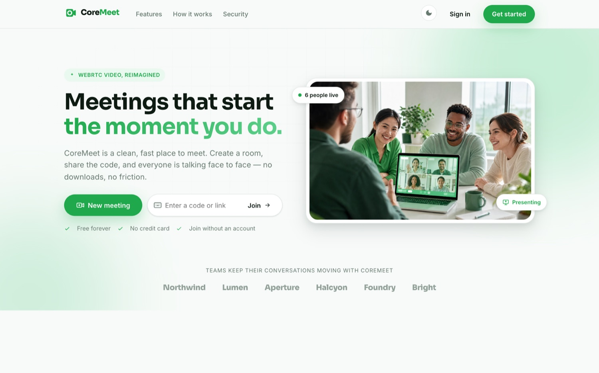
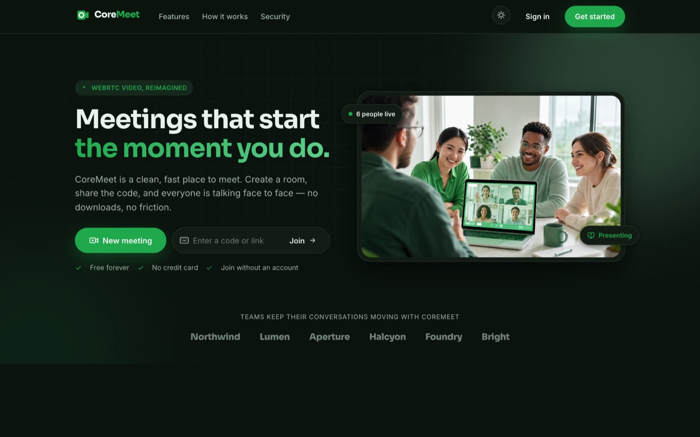
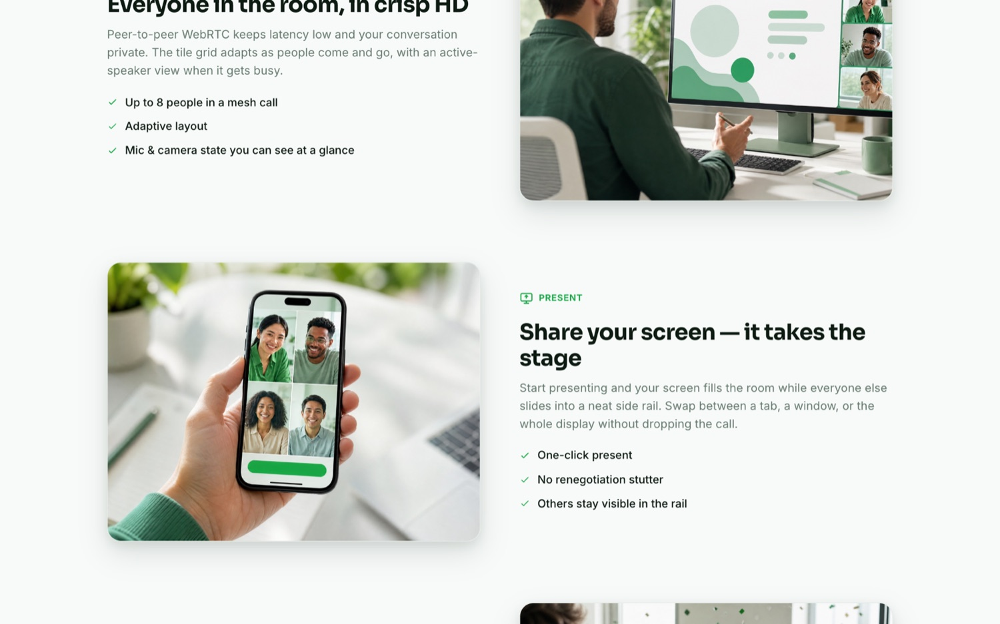
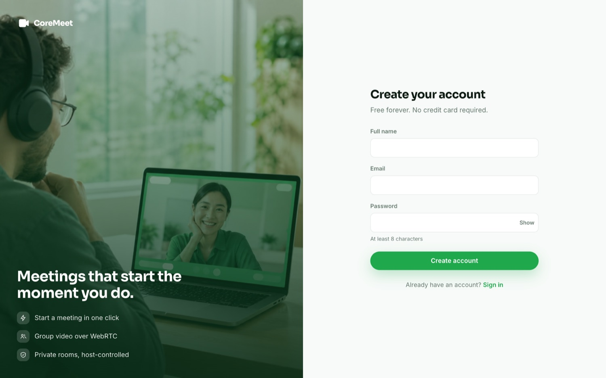
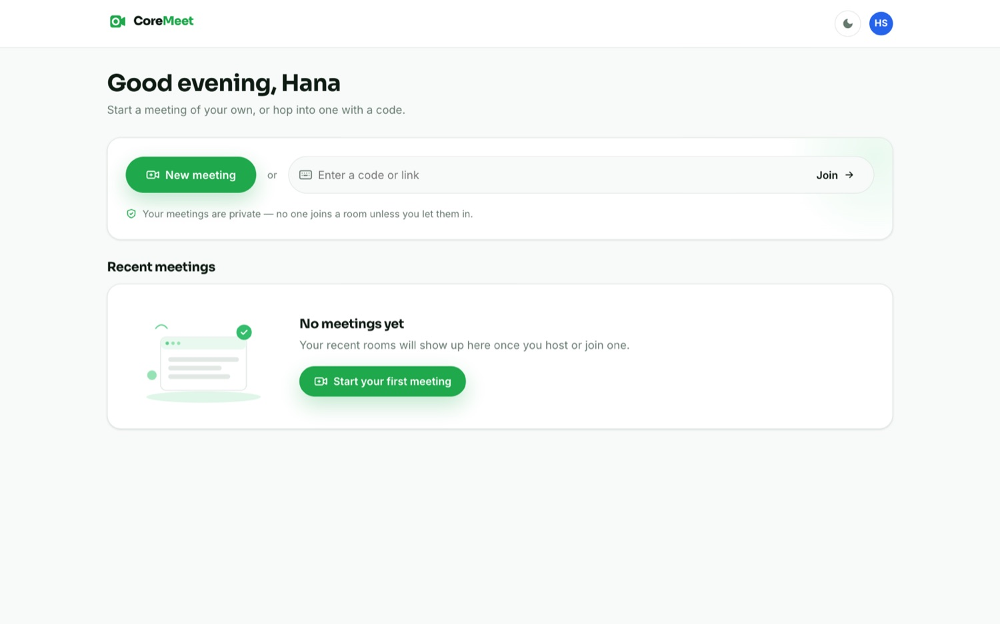
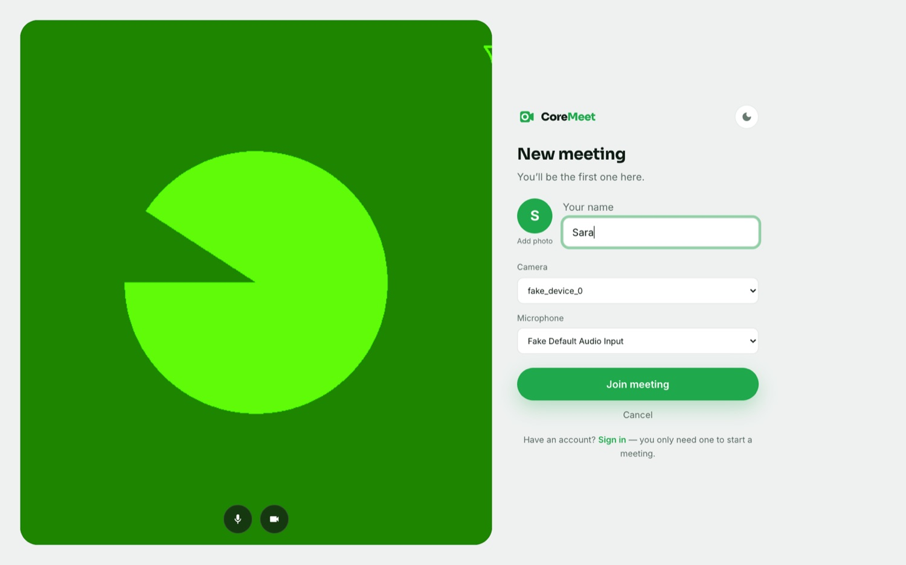
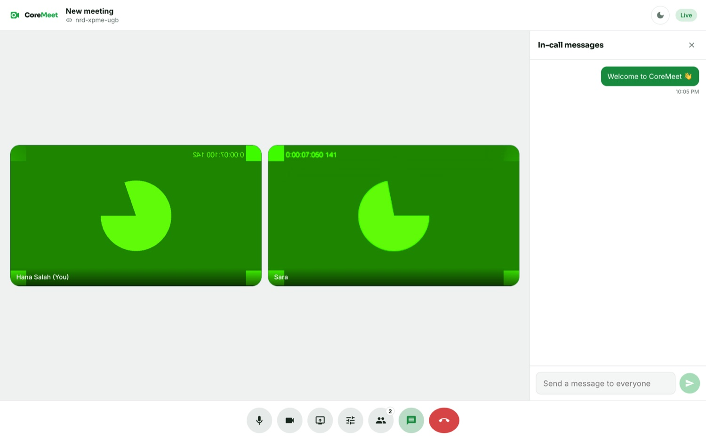
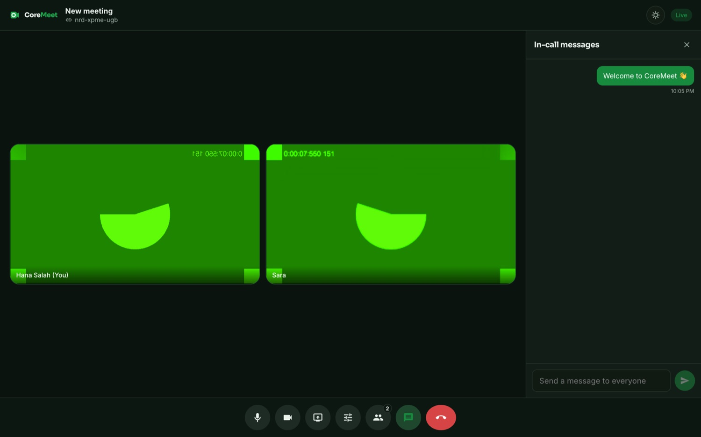
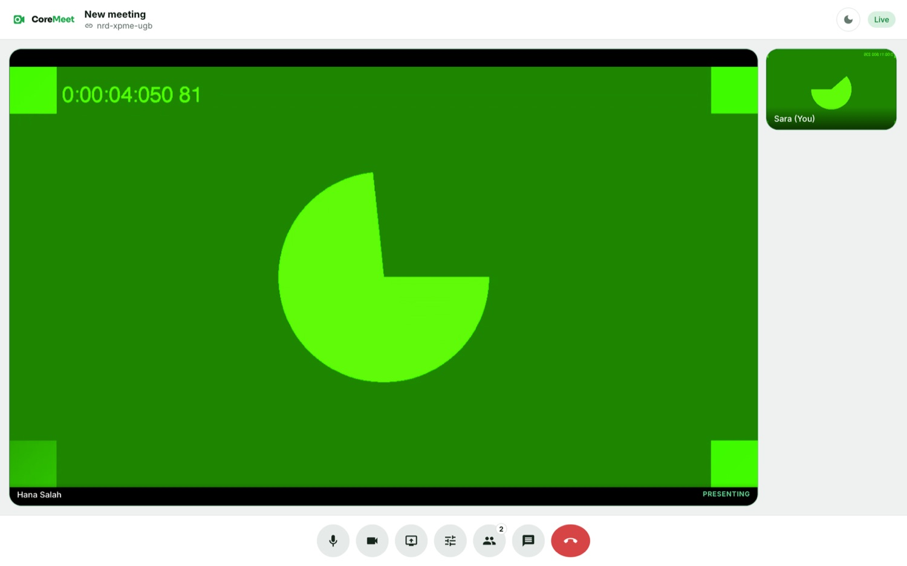

<div align="center">

# CoreMeet

**A Google Meet–style video meeting platform.**
Sign in, start a meeting, share the code — everyone is talking face to face in the browser over WebRTC.

[](https://dotnet.microsoft.com/)
[](https://react.dev/)
[](https://flutter.dev/)
[](https://webrtc.org/)
[](https://dotnet.microsoft.com/apps/aspnet/signalr)
[](#arabic--rtl)

</div>



---

## Highlights

- 🎥 **Full-mesh WebRTC** — peer-to-peer video & audio, adaptive tile grid
- 🖥️ **Screen share** — the presenter takes the stage, everyone else moves to a side rail
- 🖥️ **Desktop app** — Windows & macOS ([`desktop/`](desktop/), Electron), the full experience plus native screen share and built-in remote control
- 🖱️ **Remote control** — TeamViewer-style: a viewer drives the presenter's mouse & keyboard, with per-session consent and an instant kill-switch. Works only when the person being controlled is on the **desktop app**
- 🌍 **Arabic + English** — the whole app translated, full RTL, in-app language switcher (English by default)
- 📱 **Flutter mobile app** — Android & iOS, same backend, same features ([`mobile/`](mobile/))
- 🚪 **Pre-join lobby** — camera preview, device pickers, mic/camera set before you enter
- 👥 **Guest access** — join any meeting from a link with just a name; an account is only needed to *create* one
- 💬 **In-call chat + live roster**, host "end for everyone", keyboard shortcuts (`m` `e` `c`)
- 🎨 **Light / dark theme** (light by default), Google-Meet-style monochrome controls
- ✨ **Animated marketing site** with `framer-motion` and generated photography

---

## Screenshots

| | |
|---|---|
| **Landing — light** | **Landing — dark** |
|  |  |
| **Feature sections** | **Sign up** |
|  |  |
| **Dashboard** | **Pre-join lobby (guest)** |
|  |  |
| **Meeting room — light** | **Meeting room — dark** |
|  |  |
| **Screen share (presenter view)** | |
|  | |

<sub>The green tiles are Chrome's fake camera device used in headless testing.</sub>

---

## Stack

| Layer | Tech |
|-------|------|
| **Backend** | ASP.NET Core Web API (.NET 10), EF Core 9 + **Pomelo** MySQL provider, SignalR |
| **Frontend** | React 19 + Vite + TypeScript, `@microsoft/signalr`, `i18next` + `react-i18next`, `framer-motion` |
| **Mobile** | Flutter (Android + iOS), Riverpod, `flutter_webrtc`, `signalr_netcore`, `gen-l10n` |
| **Desktop** | Electron (Win + macOS), bundles the web UI; `desktopCapturer` screen share + `@nut-tree-fork/nut-js` input injection |
| **Real-time** | SignalR for signaling, presence, chat & remote-control relay · WebRTC (`RTCPeerConnection`) for media |
| **Database** | MySQL 8 / MariaDB 10.4+ |

```
CoreMeet/
├── backend/            ASP.NET Core solution (CoreMeet.slnx)
│   └── src/CoreMeet.Api
├── frontend/           React + Vite app (EN/AR, remote control UI)
├── mobile/             Flutter app — Android + iOS
├── desktop/            Electron desktop app — Windows + macOS
├── infra/              docker-compose (MySQL + Adminer)
├── docs/screenshots/   images used in this README
└── coremeet.sql        schema-only dump (alternative to EF migrations)
```

---

## Running locally

### 1. Database — MySQL 8 or MariaDB 10.4+

```bash
cd infra && docker compose up -d mysql
```

…or use an existing server (XAMPP, etc). Set `ConnectionStrings:Default` in
`backend/src/CoreMeet.Api/appsettings.Development.json`. The default matches a
stock XAMPP install: `server=localhost;port=3306;database=coremeet;user=root;password=`.
The server version is auto-detected at startup.

### 2. Backend → http://localhost:5099

```bash
cd backend/src/CoreMeet.Api
dotnet ef database update      # apply migrations (or import ../../coremeet.sql)
dotnet run
```

`curl http://localhost:5099/api/health` · OpenAPI at `/openapi/v1.json`.

### 3. Frontend → http://localhost:5173

```bash
cd frontend
cp .env.example .env
npm install
npm run dev
```

---

## API surface

**Auth** — `POST /api/auth/register` · `/login` · `/refresh` · `/logout` · `GET /api/auth/me`
Access tokens last 30 min; refresh tokens are 7-day, single-use and rotate on every
call — reusing a rotated token revokes the whole chain.

**Profile** — `PUT /api/profile` (name + optional avatar data URI).

**Meetings** — `POST /api/meetings` (auth) · `GET /api/meetings/mine` ·
`GET /api/meetings/{code}` · `POST /api/meetings/{code}/join` (guests allowed) ·
`POST /api/meetings/{code}/end` (host). Codes look like `abc-defg-hij`.

**Realtime hub** — `/hubs/meeting` (SignalR, JWT via `?access_token=`, guests connect anonymously):

| Client → server | Server → client |
|---|---|
| `JoinRoom(code, participantId, client?)` | `roomPeers`, `peerJoined`, `peerLeft` |
| `RenameMeeting(title)` (host) | `meetingRenamed` |
| `SendChatMessage(text)` | `chatMessage` (also persisted) |
| `SetMediaState(audio, video, screen)` | `peerMediaState` |
| `SendOffer` / `SendAnswer` / `SendIceCandidate` | `offer` / `answer` / `iceCandidate` |
| `RequestControl` / `RespondControl` / `SendControlEvent` / `RevokeControl` | `controlRequested`, `controlResponse`, `controlGranted`, `controlDenied`, `controlEvent`, `controlEnded`, `controlStarted` / `controlStopped` / `controlSessions` |

---

## Desktop app & remote control

The [`desktop/`](desktop/README.md) app (Electron, Windows + macOS) is the full
CoreMeet UI plus two things a browser can't do:

- **Native screen share** — `desktopCapturer` with a source picker (the OS-native
  picker on macOS 14.4+ / Windows).
- **Remote control** — a viewer drives the presenter's mouse & keyboard. Each
  session needs the sharer's explicit consent, shows a "being controlled" banner,
  and has an instant kill-switch (Controls → Pause). Pointer/keyboard events are
  normalised to `0..1` of the shared frame and relayed by the hub as opaque JSON;
  `@nut-tree-fork/nut-js` in the Electron main process injects them.

**Only the desktop app can be a control *target*** — the hub rejects
`RequestControl` against a browser (`client` != `"desktop"`) with `web_target`.
Anyone (browser, mobile, desktop) can *drive* a desktop target. iOS can never be
controlled.

```bash
cd desktop && npm install && npm run dev        # dev
npm run dist:mac   # or dist:win — full installer
```

---

## Arabic & RTL

`i18next` with `en` / `ar` resource files; the whole app (marketing site,
auth, dashboard, lobby, meeting room) is translated. A language toggle in every
layout persists the choice and flips `<html dir>`; layout uses CSS logical
properties so RTL mostly "just works", with targeted fixes for directional
icons and the Cairo Arabic web font. English is the default, Arabic is opt-in.

---

## Mobile app

Flutter app in [`mobile/`](mobile/) for Android + iOS, hitting the same backend:
auth, dashboard, create / join by code, lobby, WebRTC-mesh meeting room, chat,
participants, host controls, EN/AR + RTL, and the **controller side** of remote
control (drive a desktop user's shared screen (they must be on the CoreMeet desktop app)). See
[`mobile/README.md`](mobile/README.md).

```bash
cd mobile && flutter pub get && flutter run \
  --dart-define=COREMEET_API_BASE=http://10.0.2.2:5099   # Android emulator → host
```

---

## How the WebRTC mesh works

- **Topology:** full mesh — one `RTCPeerConnection` per pair of participants. Great
  for small rooms (≈ 6–8); an SFU would be the next step for bigger calls.
- **Signaling:** the joining client sends offers to everyone already in the room
  (learned from `roomPeers`); the others answer. ICE candidates are trickled and
  buffered until the remote description is set.
- **Screen share** swaps the outgoing video track with `replaceTrack` — no
  renegotiation. A `screen` flag on `peerMediaState` switches every client to the
  presenter layout.
- **STUN only** by default (`stun:stun.l.google.com:19302`). Peers on different
  NATs need a **TURN** server — web: `VITE_ICE_SERVERS` (JSON) in
  `frontend/.env.production.local`; mobile: `--dart-define=COREMEET_ICE_SERVERS`.

---

## Database schema

| Table | Key columns |
|-------|-------------|
| `users` | `id`, `name`, `email` (unique), `password_hash`, `avatar_color`, `avatar_url?` |
| `refresh_tokens` | `id`, `user_id`, `token_hash` (unique, SHA-256), `expires_at`, `revoked_at?` |
| `meetings` | `id`, `code` (unique), `title`, `host_id`, `status`, timestamps |
| `meeting_participants` | `id`, `meeting_id`, `user_id?`, `display_name`, `role`, `avatar_url?`, connect state |
| `chat_messages` | `id`, `meeting_id`, `sender_participant_id`, `sender_name`, `content`, `sent_at` |

Migrations: `InitialCreate` → `AddRefreshTokens` → `UniqueParticipantPerMeeting` → `AvatarsAndGuests`.
`coremeet.sql` is a schema-only dump for importing the structure directly.

---

## Notes

- Marketing photography is generated (emerald-branded, no stock library) and lives
  in `frontend/public/manus/*.jpg`. `BrandImage` falls back to a brand gradient if
  an asset is missing.
- `NU1903` build warning comes from `Microsoft.OpenApi` 2.0.0, a transitive pin of
  `Microsoft.AspNetCore.OpenApi` 10.0.10 — it only affects untrusted YAML parsing,
  which this API doesn't do.
